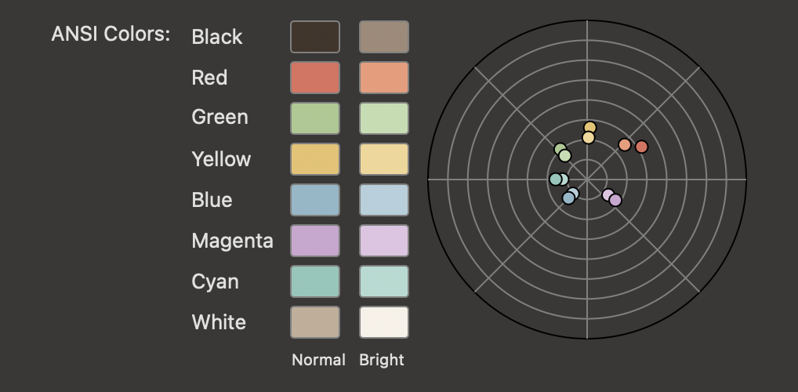

# Toski para iTerm2

Toski Dark e Toski Light para o [iTerm2](https://iterm2.com), com as cores da Toski Labs.

Veja e baixe em https://toski-labs.web.app/estudio/temas
ou na [última release](https://github.com/Toski-Labs/toski-labs-iterm-theme/releases/latest).

## Arquivos

- `Toski Dark.itermcolors` tem só as cores do escuro. No iTerm2 aparece como **Toski Dark**.
- `Toski Light.itermcolors` tem só as cores do claro. No iTerm2 aparece como **Toski Light**.
- `Toski.itermcolors` tem as duas versões, uma para o modo claro e outra para o escuro.
  No iTerm2 aparece como **☯ Toski** e troca sozinho junto com o tema do Mac.

## Instalar

1. Baixe o arquivo e dê dois cliques nele (ou, no iTerm2, *Color Presets… › Import…*).
2. No iTerm2, abra **Settings › Profiles › Colors**.
3. Em **Color Presets**, escolha **☯ Toski** (recomendado), **Toski Dark** ou **Toski Light**.

O ☯ Toski liga sozinho *Use different colors for light mode and dark mode* e preenche
Light com o Toski Light e Dark com o Toski Dark. O iTerm2 lista os presets com os dois
modos (☯) num bloco separado, no topo do menu; os de um modo só ficam no bloco de baixo,
em ordem alfabética, sem separar claros e escuros.

Para usar um preset de um modo só com a troca automática, marque *Use different colors…*,
selecione a aba **Light** e escolha Toski Light; depois a aba **Dark** e escolha Toski Dark.

## Cores

As cores do `Toski.itermcolors` são as mesmas: a coluna Toski Light vale no modo claro
e a coluna Toski Dark, no escuro.

### Interface

| Item | Toski Dark | Toski Light |
|---|---|---|
| Fundo (Background) | `#231B17` carvão | `#FBF6EE` papel |
| Texto (Foreground) | `#F1E6D8` | `#231B17` carvão |
| Negrito (Bold) | `#F7F1E8` papel | `#231B17` carvão |
| Cursor | `#DB9A5B` caramelo | `#A9541F` ferrugem |
| Texto sob o cursor | `#231B17` | `#FFF8EE` |
| Seleção | `#4A3A2E` | `#EBDAC2` |
| Texto selecionado | `#F7F1E8` | `#231B17` |
| Links | `#DB9A5B` caramelo | `#A9541F` ferrugem |
| Guia do cursor | `#2E241D` (25%) | `#F7EFE3` (25%) |
| Badge | `#A9541F` (50%) | `#A9541F` (50%) |

### ANSI

| # | Cor | Toski Dark | Toski Light |
|---|---|---|---|
| 0 | Preto | `#43352B` | `#231B17` |
| 1 | Vermelho | `#E0705E` | `#B23A2E` |
| 2 | Verde | `#A9C98F` | `#3F6E3B` |
| 3 | Amarelo | `#E8C26B` | `#8A6A00` |
| 4 | Azul | `#8FB8C9` | `#2F6185` |
| 5 | Magenta | `#CDA6D0` | `#7A4E8C` |
| 6 | Ciano | `#8CC7BA` | `#2E7468` |
| 7 | Branco | `#C2AE98` | `#E2D3BE` |
| 8 | Preto bright | `#A08A78` | `#6E5A4B` |
| 9 | Vermelho bright | `#F09A78` | `#A3341A` |
| 10 | Verde bright | `#C2DDB0` | `#33592F` |
| 11 | Amarelo bright | `#F2D693` | `#6E5500` |
| 12 | Azul bright | `#B3D0DC` | `#244C69` |
| 13 | Magenta bright | `#E0C4E2` | `#633E72` |
| 14 | Ciano bright | `#B0DBD1` | `#245C53` |
| 15 | Branco bright | `#F7F1E8` | `#FFFDF9` |

No Toski Dark as cores *bright* são mais claras; no Toski Light, mais escuras, para
continuarem legíveis no fundo papel. As cores de texto têm contraste de pelo menos 4,5:1 com o fundo (WCAG AA).
Mesmas cores do tema [Toski para VS Code](https://github.com/Toski-Labs/toski-labs-vscode-theme)
e do [Toski DS](https://github.com/Toski-Labs/toski-ds).

## Releases

Cada versão vira uma release (`v1.0`, `v1.1`…) com os três `.itermcolors` anexados.
O site baixa os arquivos da release mais recente, então o nome dos anexos precisa
continuar o mesmo entre as versões.

## Licença

[MIT](LICENSE)
